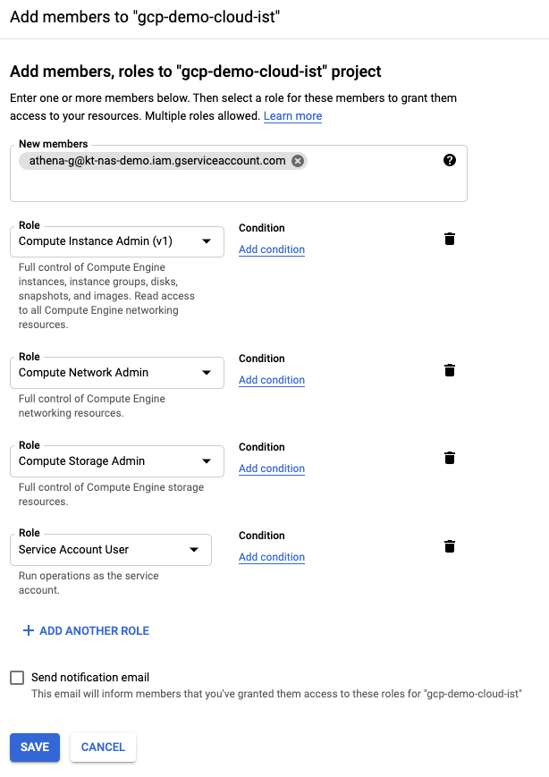

# KNE deployment within kOps-managed Kubernetes cluster on Google Cloud

## Prerequisites

1. Acquire new user credentials to use for Application Default Credentials

```Shell
gcloud auth application-default login
````

2. Install [Kustomize](https://kubectl.docs.kubernetes.io/installation/kustomize/binaries/)
3. Install [kOps](https://kops.sigs.k8s.io/getting_started/install/)

## Adopting `gcloud` command syntax to your environment

1. Throughout the document, a GCP Project ID parameter `--project=kt-nas-demo` is used for `gcloud` command syntax. Please change `kt-nas-demo` to specify a GCP Project ID you intend to use for the deployment
2. Where applicable, GCP Region `us-west1` (Oregon) and/or Zone `us-west1-b` are used withing the document. Consider changing to a region and zone that fit your deployment via `--region=us-west1` and `--zone=us-west1-b` parameters.


## Prepare Google Cloud VPC networking

1. Create a VPC network for K8s cluster deployment

| Parameter 						| Value
| --- 									| ---
| Name 									| `kne-demo`
| Description 					| Kubernetes Network Emulation Demo
| Subnets 							| Auto

```Shell
gcloud compute networks create kne-demo --project=kt-nas-demo --description="Kubernetes Network Emulation Demo" --subnet-mode=auto --mtu=1460 --bgp-routing-mode=regional
```

2. Create firewall rules for the VPC - we're going to permit all internal connectivity for now, and SSH access from the outside

```Shell
gcloud compute firewall-rules create kne-demo-allow-internal --project=kt-nas-demo --network=projects/kt-nas-demo/global/networks/kne-demo --description=Allows\ connections\ from\ any\ source\ in\ the\ network\ IP\ range\ to\ any\ instance\ on\ the\ network\ using\ all\ protocols. --direction=INGRESS --priority=65534 --source-ranges=10.128.0.0/9 --action=ALLOW --rules=all
gcloud compute firewall-rules create kne-demo-allow-ssh --project=kt-nas-demo --network=projects/kt-nas-demo/global/networks/kne-demo --description=Allows\ TCP\ connections\ from\ limited\ sources\ to\ any\ instance\ on\ the\ network\ using\ port\ 22. --direction=INGRESS --priority=65534 --source-ranges="`curl -s ifconfig.me`/32" --action=ALLOW --rules=tcp:22
gcloud compute firewall-rules create kne-demo-allow-https --project=kt-nas-demo --network=projects/kt-nas-demo/global/networks/kne-demo --description=Allows\ TCP\ connections\ from\ limited\ sources\ to\ any\ instance\ on\ the\ network\ using\ port\ 443. --direction=INGRESS --priority=65534 --source-ranges="`curl -s ifconfig.me`/32" --action=ALLOW --rules=tcp:443
```

4. Give the service account created in Prerequisites section the following IAM roles

	* Compute Instance Admin
	* Compute Network Admin
	* Storage Admin
	* Service Account User




[//]: # (TODO replace with gcloud cli syntax)

5. Create a storage bucket for kOps to keep K8s cluster configuration

```Shell
gsutil mb -p kt-nas-demo -l us-west1 gs://kne-demo-bucket-${USER}
````

[//]: # (TODO this is somehow broken - once cluster is created, API can't be accessed. No problem with manually created storage bucket)

## Deploy Kubernetes Cluster for KNE

1. Create a K8s cluster using kOps

```Shell
export KOPS_STATE_STORE=gs://kne-demo-bucket-${USER}
export KOPS_FEATURE_FLAGS=AlphaAllowGCE

export CLUSTER=$USER.k8s.local
export SITE="`curl -s ifconfig.me`/32" # ip range you will be accessing cluster from
export ZONES=us-west1-b
export VPC=kne-demo
export SVCACCNT=athena-g@kt-nas-demo.iam.gserviceaccount.com

./kne-demo/scripts/cluster_deploy.sh

sleep 300
kops validate cluster $CLUSTER --wait 10m
````

2. Add Meshnet CNI to K8s cluster and validate `meshnet` namespace is present in the cluster

```Shell
kustomize build ./kne/manifests/meshnet/base | kubectl apply -f -
kubectl get pods -n meshnet
````

3. To make kOps environment persistent accross multiple shell sesssions, set the following env variables in `$HOME/.bash_profile`:

```Shell
cat >> $HOME/.bash_profile << EOF
# Set kOps environment for KNE
export KOPS_STATE_STORE=gs://kne-demo-bucket-${USER}
export KOPS_FEATURE_FLAGS=AlphaAllowGCE
EOF
```

Now try validating the cluster status in a new shell session

```Shell
kops validate cluster $USER.k8s.local --wait 10m
```

## Misc

* Kubectl configuration created by kOps contains API keys with expiration of 1 day. To refresh the keys, run the following command

```Shell
kops export kubecfg $USER.k8s.local
````


