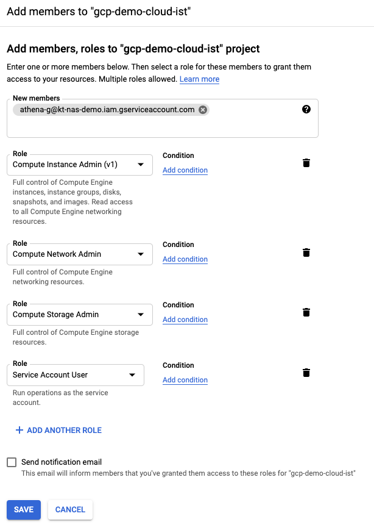
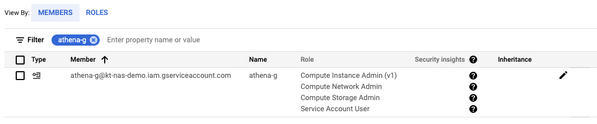

# KNE and Athena Deployment

## Overview
This deployment of [KNE](https://github.com/google/kne) would be using Google Cloud infrastructure with a custom Kubernetes cluster installed as part of the setup.

## Prerequisites

1. A Google account with Google Cloud access
2. Your Google account should be granted access to Keysight Athena repository at https://source.cloud.google.com/kt-nts-athena-dev/keysight/ (TODO what is a proper way to request access to the repo?)
3. Install [Google Cloud SDK](https://cloud.google.com/sdk/docs) and authenticate via

```Shell
gcloud init
````

4. Create a [GCP Service Account](https://console.cloud.google.com/iam-admin/serviceaccounts) and request Keysight Athena team to provide proper access permissions for the account to access Athena artifacts. In this setup I'm using `athena-g@kt-nas-demo.iam.gserviceaccount.com` Sevice Account

```Shell
gcloud iam service-accounts create athena-g@kt-nas-demo.iam.gserviceaccount.com
gcloud projects add-iam-policy-binding kt-nas-demo --member="serviceAccount:athena-g@kt-nas-demo.iam.gserviceaccount.com" --role="roles/owner"
gcloud iam service-accounts keys create athena-g.json --iam-account=athena-g@kt-nas-demo.iam.gserviceaccount.com
````

[//]: # (TODO proper location for athena-g.json file)
[//]: # (TODO what is a proper way to request access to the artifacts?)

4. Acquire new user credentials to use for Application Default Credentials

```Shell
gcloud auth application-default login
````

5. Install [kOps](https://kops.sigs.k8s.io/getting_started/install/)
6. Install [Go](https://golang.org/dl/) for your platform

## Adopting command syntax to your environment

1. Throughout the document, a GCP Project ID parameter `--project=kt-nas-demo` is used for `gcloud` command syntax. Please change `kt-nas-demo` to specify a GCP Project ID you intend to use for the deployment
2. Where applicable, GCP Region `us-west1` (Oregon) and/or Zone `us-west1-b` are used withing the document. Consider changing to a region and zone that fit your deployment via `--region=us-west1` and `--zone=us-west1-b` parameters.

## Initialize a Kubernetes Cluster for KNE

1. Create a VPC network for K8s cluster deployment

| Parameter 						| Value
| --- 									| ---
| Name 									| `kne-demo`
| Description 					| Kubernetes Network Emulation Demo
| Subnets 							| Auto

```Shell
gcloud compute networks create kne-demo --project=kt-nas-demo --description="Kubernetes Network Emulation Demo" --subnet-mode=auto --mtu=1460 --bgp-routing-mode=regional
```

2. Create firewall rules for the VPC - we're going to permit all internal connectivity for now, and SSH access from the outside

```Shell
gcloud compute firewall-rules create kne-demo-allow-internal --project=kt-nas-demo --network=projects/kt-nas-demo/global/networks/kne-demo --description=Allows\ connections\ from\ any\ source\ in\ the\ network\ IP\ range\ to\ any\ instance\ on\ the\ network\ using\ all\ protocols. --direction=INGRESS --priority=65534 --source-ranges=10.128.0.0/9 --action=ALLOW --rules=all
gcloud compute firewall-rules create kne-demo-allow-ssh --project=kt-nas-demo --network=projects/kt-nas-demo/global/networks/kne-demo --description=Allows\ TCP\ connections\ from\ limited\ sources\ to\ any\ instance\ on\ the\ network\ using\ port\ 22. --direction=INGRESS --priority=65534 --source-ranges="`curl -s ifconfig.me`/32" --action=ALLOW --rules=tcp:22
gcloud compute firewall-rules create kne-demo-allow-https --project=kt-nas-demo --network=projects/kt-nas-demo/global/networks/kne-demo --description=Allows\ TCP\ connections\ from\ limited\ sources\ to\ any\ instance\ on\ the\ network\ using\ port\ 443. --direction=INGRESS --priority=65534 --source-ranges="`curl -s ifconfig.me`/32" --action=ALLOW --rules=tcp:443
```

4. Give the service account created in Prerequisites section the following IAM roles

	* Compute Instance Admin
	* Compute Network Admin
	* Storage Admin
	* Service Account User





5. Create a storage bucket for kOps to keep K8s cluster configuration

```Shell
gsutil mb -p kt-nas-demo -l us-west1 gs://kne-demo-bucket-${USER}
````

[//]: # (TODO this is somehow broken - once cluster is created, API can't be accessed. No problem with manually created storage bucket)


6. Permit healthchecks

```Shell
gcloud compute firewall-rules create kne-demo-allow-health-checks \
    --network=kne-demo \
    --action=ALLOW \
    --direction=INGRESS \
    --source-ranges=35.191.0.0/16,130.211.0.0/22,209.85.152.0/22,209.85.204.0/22 \
    --rules=tcp
````

[//]: # (TODO remove H/C rules since kops is not using then)


7. Create a K8s cluster using kOps

```Shell
export KOPS_STATE_STORE=gs://kne-demo-bucket-${USER}
export KOPS_FEATURE_FLAGS=AlphaAllowGCE

export CLUSTER=$USER.k8s.local
export SITE="`curl -s ifconfig.me`/32" # ip range you will be accessing cluster from
export ZONES=us-west1-b
export VPC=kne-demo
export SVCACCNT=athena-g@kt-nas-demo.iam.gserviceaccount.com

./scripts/cluster_deploy.sh

sleep 300
kops validate cluster $CLUSTER --wait 10m
````

8. Add Meshnet CNI to K8s cluster and validate `meshnet` namespace is present in the cluster

```Shell
kubectl apply -f configs/meshnet.yaml
kubectl get pods -n meshnet
````
## Deploy KNE

1. Clone KNE repository

```Shell
git clone https://github.com/google/kne.git
cd kne
````

2. Compile KNE

```Shell
cd kne_cli
go build 
cd ..
````

3. To test KNE operations, create a simple two-node topology and validate `2node-host` namespace is present in the cluster

```Shell
./kne_cli/kne_cli create ./examples/2node-host.pb.txt
./kne_cli/kne_cli show ./examples/2node-host.pb.txt
kubectl get pods -n 2node-host
````

4. Check both PODs have two eth interfaces each, `eth0` and `eth1`. Note status of interface `eth1`, it should be `<BROADCAST,MULTICAST,UP,LOWER_UP,M-DOWN>`

```Shell
kubectl exec -it vm-1 -n 2node-host -- ip a
kubectl exec -it vm-2 -n 2node-host -- ip a
````

5. Bring `eth1` on the first node down, and validate that on the second node `eth1` status changes to `<NO-CARRIER,BROADCAST,MULTICAST,UP,M-DOWN>`

```Shell
kubectl exec -it vm-1 -n 2node-host -- ip link set eth1 down
kubectl exec -it vm-2 -n 2node-host -- ip a
````

6. Bring `eth1` on the first node up, and validate that on the second node `eth1` status changes to `<BROADCAST,MULTICAST,UP,LOWER_UP,M-DOWN>`

```Shell
kubectl exec -it vm-1 -n 2node-host -- ip link set eth1 up
kubectl exec -it vm-2 -n 2node-host -- ip a
````

7. Destroy the two-node topology

```Shell
./kne_cli/kne_cli delete ./examples/2node-host.pb.txt
kubectl get pods -n 2node-host
````

This concludes initial KNE deployment and validation steps. As part of the validation, we confirmed Meshnet CNI "wire" up/down operations between two nodes.

## Misc

* To make kOps environment persistent accross multiple shell sesssions, set the following env variables in `$HOME/.bash_profile`:

```Shell
cat >> $HOME/.bash_profile << EOF
# Set kOps environment for KNE
export KOPS_STATE_STORE=gs://kne-demo-bucket-${USER}
export KOPS_FEATURE_FLAGS=AlphaAllowGCE
EOF
```

Now try validating the cluster status in a new shell session

```Shell
kops validate cluster $USER.k8s.local --wait 10m
```

* Kubectl configuration created by kOps contains API keys with expiration of 1 day. To refresh the keys, run the following command

```Shell
kops export kubecfg $USER.k8s.local
````

* To delete K8s cluster created by kOps, use

```Shell
kops delete cluster $USER.k8s.local --yes
````
