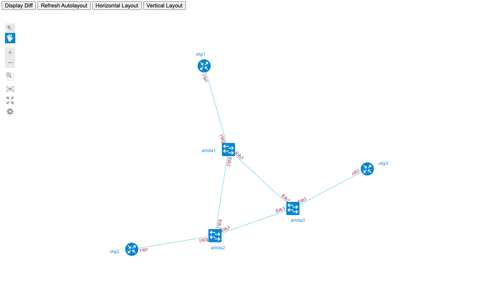

# KNE Live Network Tolopogy Visualization with Ixia-c nodes

## Overview

For topology visualization, we're going to use Cisco NextUI engine and a patched version of [`devnet_marathon_endgame`](https://idebugall.github.io/visualize-lldp/) script to create live network inventory based on LLDP information. Since Ixia-c doesn't support LLDP, a sidecar container with `lldpd` would be automatically injected into Ixia-c PODs. In order to automatically inject sidecar images, Ixia-c node names have to start with `otg` prefix.

By following these steps, you should be able to generate a topology visualization similar to this image:



## Prerequisites

* KNE environenment [deployed](DEPLOY.md) on any supported version of K8s
* Ixia-c subsystem [initialized](DEPLOY.md#initialize-ixia-traffic-generator-athena-subsystem) on top of KNE environment
* Python 3
* PIP
* virtualenv
* In terminal, navigate to a base folder, under which you already installed Ixia-c and KNE components. Remember the path in `BASE_DIR` variable

```Shell
export BASE_DIR=`pwd`
````

## Install visualization engine and scripts. Run these steps only once

1. Create virtual environment called `nextui`

```Shell
cd $BASE_DIR
virtualenv -p python3 nextui
````

2. Install `devnet_marathon_endgame`

```Shell
cd $BASE_DIR
source "$BASE_DIR/nextui/bin/activate"
git clone https://github.com/bortok/devnet_marathon_endgame.git
cd devnet_marathon_endgame
git checkout eos-dequote-ifnames
pip3 install -r requirements.txt
````

3. Inventory. Update file system paths to inventory and group files for Nornir

```Shell
cd $BASE_DIR/devnet_marathon_endgame/inventory
rm groups.yml hosts_devnet_sb_cml.yml
ln -s $BASE_DIR/kne-demo/nornir/groups.yml .
ln -s $BASE_DIR/kne-demo/nornir/nornir_ixia-c-ceos-3node_inventory.yml hosts_devnet_sb_cml.yml
````

## Initialize automatic sidecar injection for LLDP support. Run these steps only once

1. If using KIND to run KNE: pull `ubuntu-host` image and load it into KNE cluster

```Shell
docker pull gcr.io/kt-nts-athena-dev/athena/ubuntu-host:latest
kind load docker-image gcr.io/kt-nts-athena-dev/athena/ubuntu-host:latest --name=kne
````

1. Initialize [Kubemod](https://github.com/kubemod/kubemod)

```Shell
kubectl label namespace kube-system admission.kubemod.io/ignore=true --overwrite
kubectl apply -f https://raw.githubusercontent.com/kubemod/kubemod/v0.13.0/bundle.yaml
````

2. Label remaining namespaces where automatic sidecar injection should never occur

```Shell
kubectl label namespace ixiatg-op-system admission.kubemod.io/ignore=true --overwrite
kubectl label namespace kubemod-system admission.kubemod.io/ignore=true --overwrite
kubectl label namespace local-path-storage admission.kubemod.io/ignore=true --overwrite
kubectl label namespace meshnet admission.kubemod.io/ignore=true --overwrite
kubectl label namespace metallb-system admission.kubemod.io/ignore=true --overwrite
````

3. Apply a rule for automatic injection of `ubuntu-host` sidecar container with `lldpd` daemon

```Shell
kubectl apply -f $BASE_DIR/kne-demo/modrule/modrule-ixia-c-add-lldpd.yaml -n kubemod-system
````

To validate or inspect the modrule, use

```Shell
kubectl get modrule -n kubemod-system
kubectl describe modrule modrule-ixia-c-add-lldpd -n kubemod-system
````

## Create and visualize a topology

These steps could be repeated, including use of a different topology.

1. Create a topology

```Shell
cd $BASE_DIR/kne-demo/topologies/
kne_cli create kne_ixia-c-ceos-3node_config.txt
kubectl get pods -n ixia-c-ceos-3node
````

2. Explore LLDP neighbors from Arista devices

```Shell
kubectl exec -it arista1 -n ixia-c-ceos-3node -- Cli
show lldp neighbors
exit

kubectl exec -it arista2 -n ixia-c-ceos-3node -- Cli
show lldp neighbors
exit

kubectl exec -it arista3 -n ixia-c-ceos-3node -- Cli
show lldp neighbors
exit
````

3. To inspect `ubuntu-host` sidecar, use

```Shell
kubectl logs otg1 -c ubuntu-host -n ixia-c-ceos-3node
kubectl exec -it otg1 -c ubuntu-host -n ixia-c-ceos-3node -- /bin/bash
````

4. Visualize the emulated topology

```Shell
kubectl get services -n ixia-c-ceos-3node | grep arista | awk '{ print $4 "\t" $1 }' | sudo bash -c "cat >> /etc/hosts"
cd $BASE_DIR/devnet_marathon_endgame; python3 generate_topology.py; cd $BASE_DIR
````

Open `main.html` from `$BASE_DIR/devnet_marathon_endgame` in the browser to view the topology.

5. Cleanup topology

```Shell
cd $BASE_DIR/kne-demo/topologies/
kne_cli delete kne_ixia-c-ceos-3node_config.txt
kubectl get pods -n ixia-c-ceos-3node
cd $BASE_DIR/devnet_marathon_endgame
rm topology.js diff_topology.js cached_topology.json
cd $BASE_DIR
cat /etc/hosts | grep -v "service-arista" | sudo bash -c "cat > /etc/hosts
````

## Cleanup cluster

1. To cleanup cluster, run

```Shell
kubectl delete modrule modrule-ixia-c-add-lldpd -n kubemod-system
kubectl delete -f https://raw.githubusercontent.com/kubemod/kubemod/v0.13.0/bundle.yaml
````
